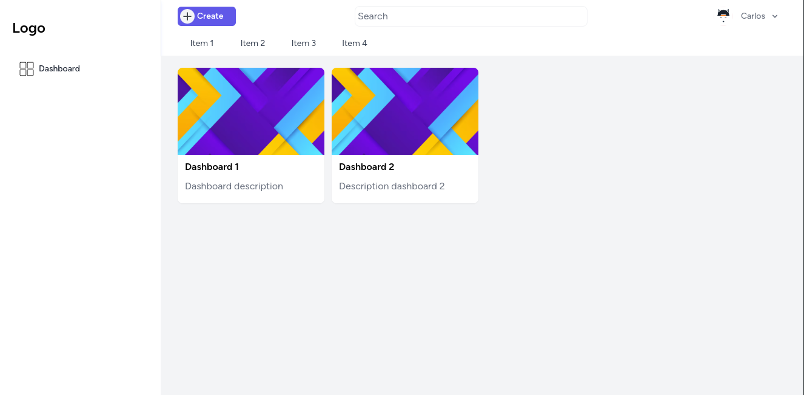
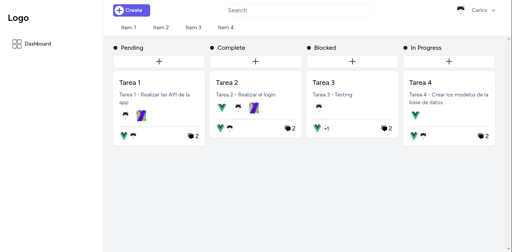
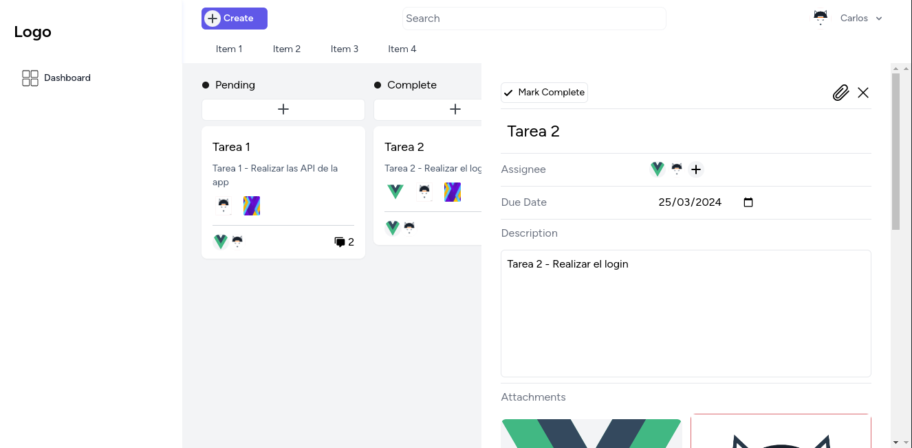
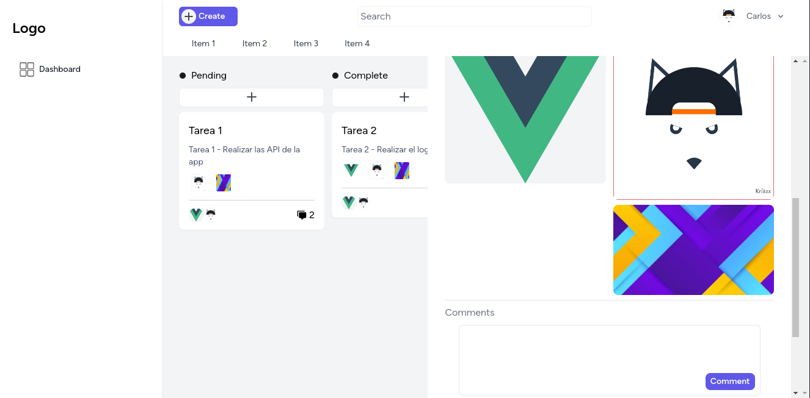
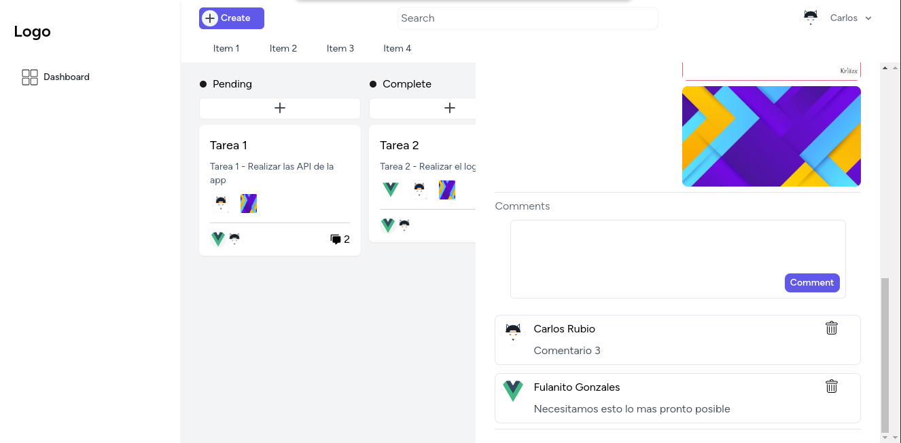
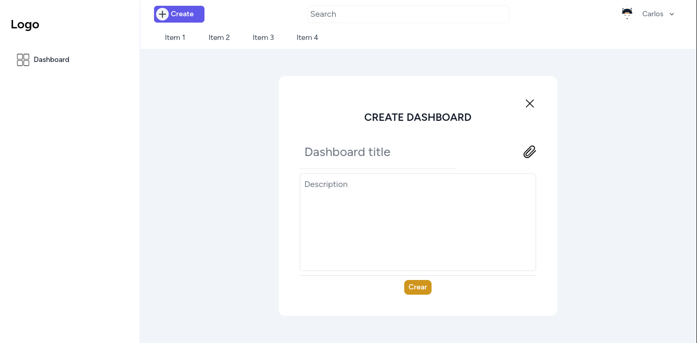
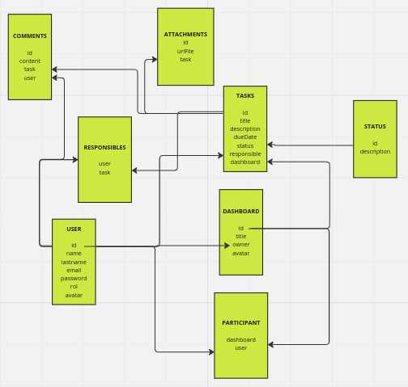

# APLICACION DE GESTION DE TAREAS

## ACERCA DEL PROYECTO

Aplicacion para la creacion y gestion de tareas para usuarios.

## SCREENSHOTS







## BASE DE DATOS

Diagrama base de datos


## PRUEBAS API

- **Users**
  - Crear: POST http://localhost:8000/users/

    JSON con los siguientes datos
    ```
      {
        "name": string,
        "lastname": string,
        "email": string,
        "password": string,
        "avatar": image,
        "role": string
      }
    ```
  - Actualizar usuarios: PUT http://localhost:8000/users/{user}

    JSON con los siguientes datos (No es necesario actualizarlos todos)
    ```
      {
        "name": string,
        "lastname": string,
        "email": string,
        "password": string,
        "avatar": image,
        "role": string
      }
    ```
    
  - Eliminar usuarios: DELETE http://localhost:8000/users/{user}

  - Obtener usuarios con rol de empleado: GET http://localhost:8000/users/employees

  - Obtener usuarios con rol de admin: GET http://localhost:8000/users/admin

  - Obtener usuarios por id de empleado: GET http://localhost:8000/users/employees/{idEmployee}

  - Obtener usuarios por dashboard: GET http://localhost:8000/users/dashboard/{idDashboard}

- **Login**: POST http://localhost:3000/login
  
  JSON Con los siguientes datos

  ```
    {
      "email": string,
      "password": string
    }
  ```

  Usuario para pruebas

  ```
    {
      "email": "rubio@example.com",
      "password": "1234"
    }
  ```

- **Dashboards**
  - Crear: POST http://localhost:8000/dashboards

    JSON Con los siguientes datos

    ```
      {
        "title": string,
        "description": string,
        "avatar": image,
        "owner": number
      }
    ```

  - Actualizar: PUT http://localhost:8000/dashboards/{dashboard}

    JSON Con los siguientes datos

    ```
      {
        "title": string,
        "description": string,
        "avatar": image,
        "owner": number
      }
    ```

  - Eliminar: DELETE http://localhost:8000/dashboards/{dashboard}

    dashboard = Es un id de un dashboard valido

  - Obtener todos los dashboards por id empleado: GET http://localhost:8000/dashboards/employee/{idEmployee}
  
    idEmployee = Es un id de un usuario valido

  - Obtener todos los dashboards por owner: GET http://localhost:8000/dashboards/owner
  
- **Tasks**
  - Crear: POST http://localhost:8000/tasks/

    JSON Con los siguientes datos

    ```
      {
        "title": string,
        "description": string,
        "owner": number,
        "avatar": image
      }
    ```

  - Actualizar: PUT http://localhost:8000/tasks/{task}

    JSON Con los siguientes datos

    ```
      {
        "title": string,
        "description": string,
        "owner": number,
        "avatar": image
      }
    ```

  - Eliminar: DELETE http://localhost:8000/tasks/{task}

  - Obtener tareas por dashboard: GET http://localhost:8000/tasks/dashboard/{idDashboard}

  - Obtener tareas por estado: GET http://localhost:8000/tasks/status/{idStatus} 

- **Status**
  - Obtener todos los estados de las tareas: GET http://localhost:8000/statuses/

  - Obtener un estado de tarea por id: GET http://localhost:8000/statuses/{id}

- **Comments**
  - Crear: POST http://localhost:8000/comments/

    JSON Con los siguientes datos

    ```
      {
        "content": string,
        "task": number,
        "user": number
      }
    ```

  - Actualizar: PUT http://localhost:8000/comments/{comment}

    JSON Con los siguientes datos

    ```
      {
        "content": string,
        "task": number,
        "user": number
      }
    ```

  - Eliminar: DELETE http://localhost:8000/comments/{comment}

  - Obtener los comentarios por tarea: GET http://localhost:8000/comments/task/{idTask}

- **Roles**
  - Obtener todos los roles existentes: GET http://localhost:8000/roles/

  - Obtener un rol especifico: GET http://localhost:8000/roles/{id}


## TECNOLOGIAS

- MYSQL
- PHP
- LARAVEL
- VUEJS
- INERTIA
- TAILWINDCSS
- VUEX

## SCRIPTS

### `npm run dev`

Levantar el servidor de vue en modo de desarrollo

### `php artisan serve`

Levantar el servidor de laravel en modo desarrollo

### `php artisan migrate:fresh --seed`

Para eliminar y recrear las tablas y sus campos y ejecutar los seeders para rellenarlas con data predefinida